# Lab Assignment – Using PROLOG

**Student Name:** Tasnia Chowdhury Nafisa  
**Student ID:** 20701038

---

## Description

This repository contains the solutions and experiments completed as part of the **Lab Assignment on PROLOG**.  
The objective of the assignment is to implement basic PROLOG programs and execute them within a DOSBox/PROLOG environment to demonstrate fundamental logic programming concepts.

---

## Screenshots

The following screenshots illustrate the implementation and execution of the assignment tasks in PROLOG:

1. **Program Initialization**  
   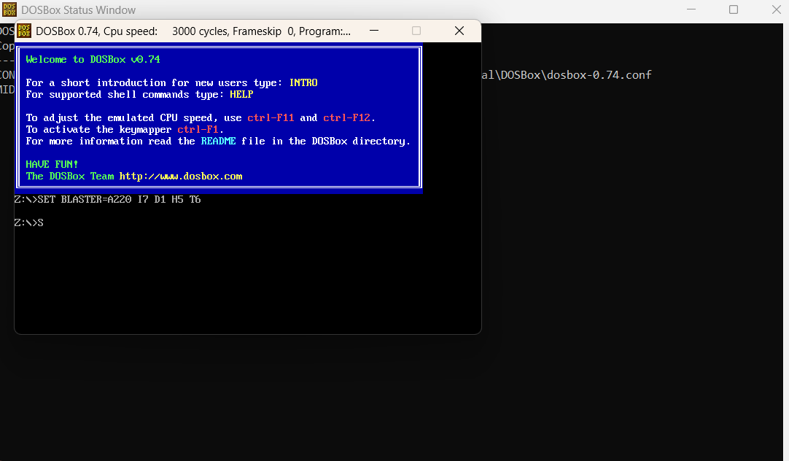

2. **Execution of Predicates and Clauses**  
   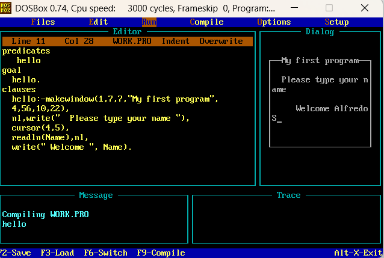

3. **Sample Goal Execution and Output**  
   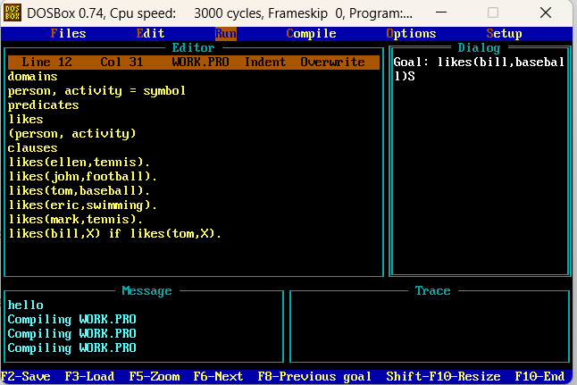

   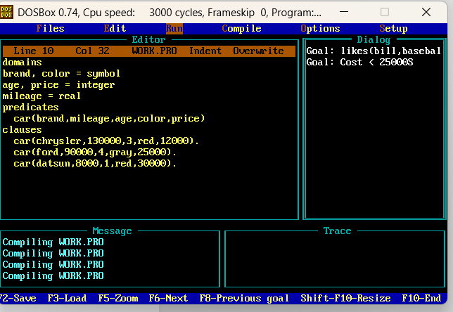
   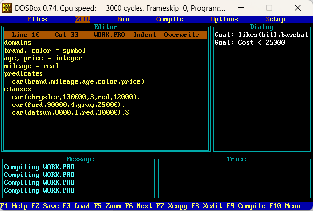
   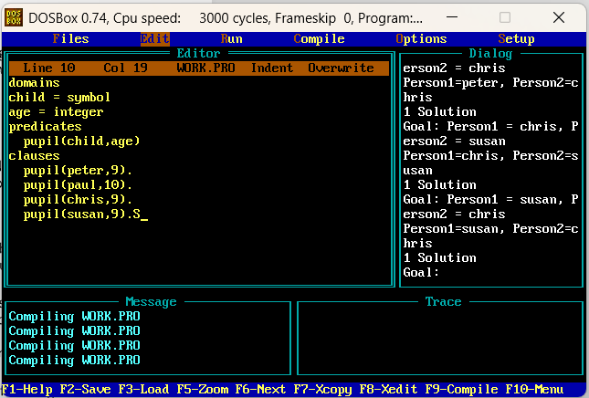
   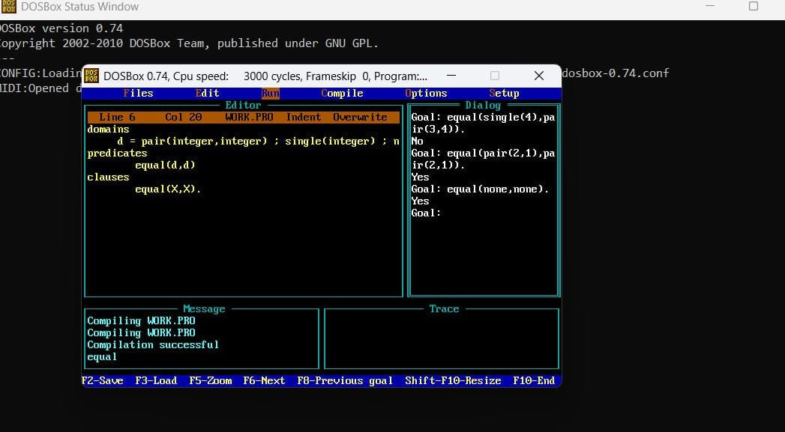
   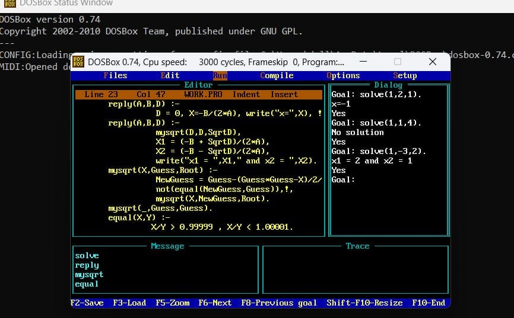
   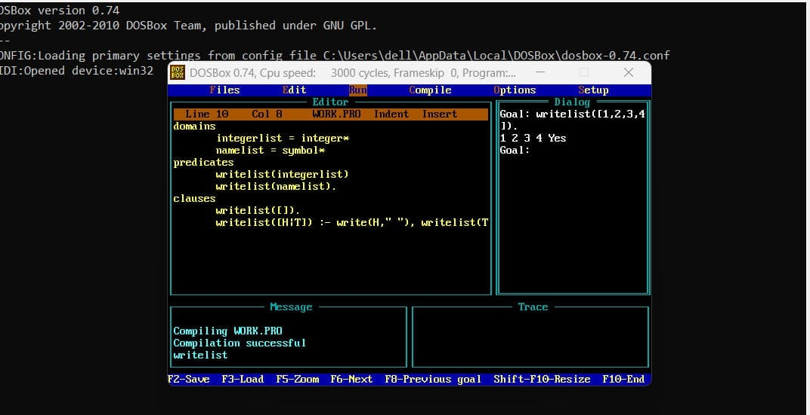
   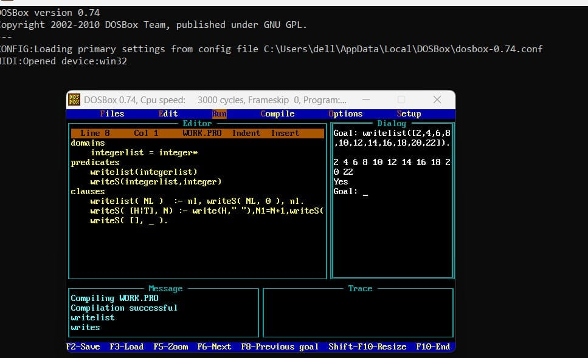
   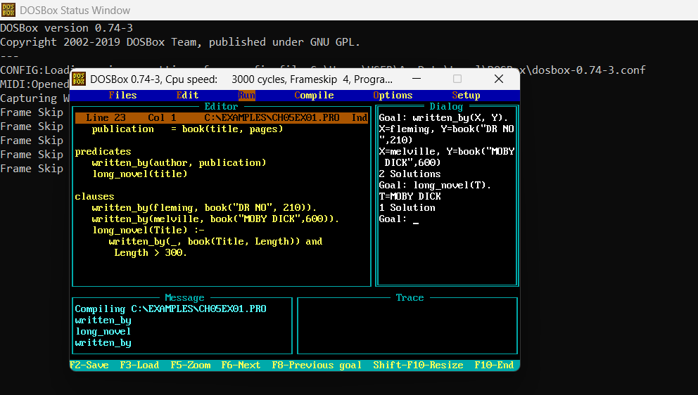
   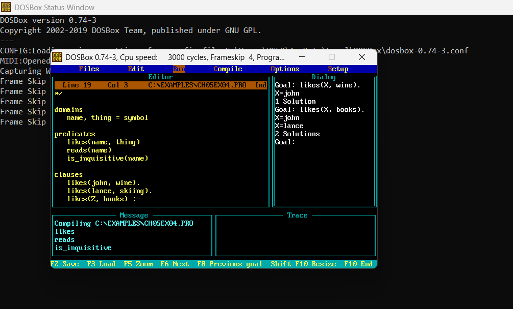
   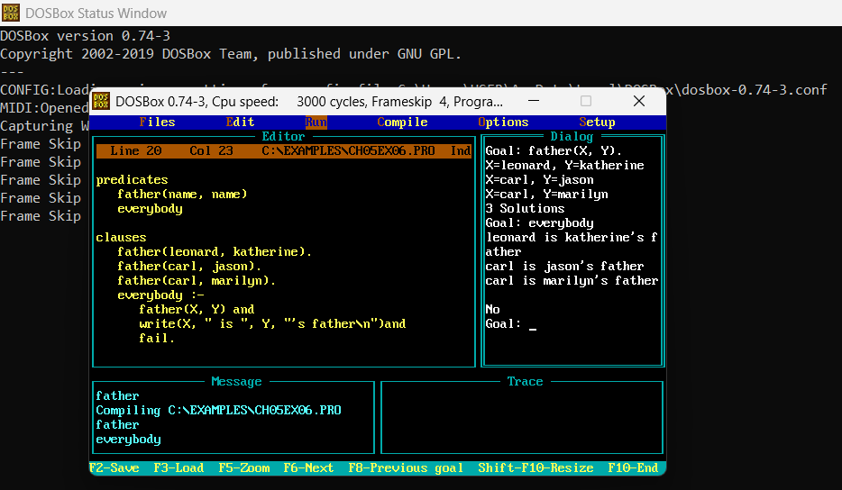
   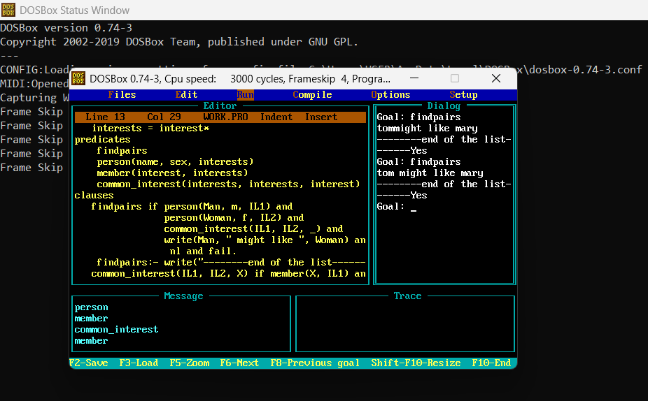

---

## Notes

- All programs were written and executed in the DOSBox PROLOG environment.
- The screenshots provide both the **editor view (source code)** and the **dialog view (goal execution results)**.
